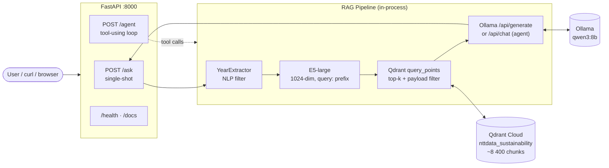
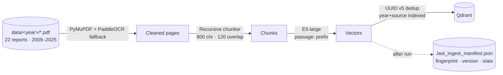

# Sustainability Report Chat

> Retrieval-augmented Q&A over **22 sustainability reports (2009–2025)**.
> Local LLM (Ollama), managed Qdrant, FastAPI, opt-in tool-using agent.

```bash
./start.sh
curl -X POST http://localhost:8000/ask \
     -H 'Content-Type: application/json' \
     -d '{"question":"What are 2024 emissions targets?"}'
```

```bash
./start.sh
curl -X POST http://localhost:8000/agent \
     -H 'Content-Type: application/json' \
     -d '{"question":"Compare scope 1+2 emissions targets between 2020 and 2024"}'
```

## Quick Start
OCR + embed:
```bash
python scripts/index_pdfs.py --phase extract
```
Service:
```bash
uvicorn app:app --host 0.0.0.0 --port 8000 --reload
```

---

## Highlights

- **Multilingual E5-large** embeddings (1024-dim, normalised cosine) + recursive chunker with overlap
- **Auto year extraction** from natural questions (no `--year` flag needed; `latest`, `FY2023`, comparison queries all handled)
- **Numbered citations** `[N]` mapped to verifiable source snippets (~500 chars each)
- **Tool-using agent** (`/agent`) for multi-step / comparison queries via Ollama's native tool calling
- **Production health**: `/health` (verbose with latency per component)
- **Idempotent ingest** with deterministic UUID v5 chunk IDs and on-disk version manifest
- **Single Dockerfile** + `docker-compose` orchestration (Qdrant Cloud + local Ollama + API)
- **CI/CD** via GitHub Actions (lint + pytest + Docker build), 23 unit tests

---

## Architecture

### Runtime



### Ingest (offline, run once per data refresh)



---

## Quickstart

### One-command bootstrap (recommended)

```bash
git clone <repo> && cd sustainability-report-chat
cp .env.example .env          # edit QDRANT_URL + QDRANT_API_KEY
./start.sh                    # boot api + ollama
./start.sh --recreate         # one-time index of the PDFs in data/
```

After boot:

| URL | Purpose |
|---|---|
| http://localhost:8000/docs | Swagger UI — try `/ask`, `/agent`, `/health` |
| http://localhost:8000/health | Verbose health (per-component latency) |

### Manual (no docker)

```bash
python3 -m venv .venv && source .venv/bin/activate
pip install -r requirements.txt
ollama pull qwen3:8b
python scripts/index_pdfs.py --recreate
uvicorn app:app --host 0.0.0.0 --port 8000 --reload
```

---

## API

### `POST /ask` — single-shot RAG

```bash
curl -X POST http://localhost:8000/ask \
  -H 'Content-Type: application/json' \
  -d '{"question":"What are 2024 emissions targets?"}'
```

Response shape:

```json
{
  "answer": "NET-ZERO Vision 2040 includes net-zero for data centers by 2030 [1], offices by 2035 [1], and supply chain by 2040 [1]. Targets were SBTi-certified in March 2024 [1] ...",
  "sources": [
    {
      "ref": 1,
      "source": "sr2024.pdf",
      "year": "2024",
      "page_num": 22,
      "chunk_id": "sr2024.pdf::p22::c2",
      "score": 0.898,
      "snippet": "ombination with Ltd., has revised its goal..."
    }
  ]
}
```

Optional body fields:
- `top_k` (int) — override retrieval depth
- `year` (str) — explicit year filter (auto-extracted from question if omitted)
- `source` (str) — restrict to one PDF filename

### `POST /agent` — tool-using agent

For comparison or multi-step questions. Same input shape; response adds `steps` so you can audit what the agent did.

```bash
curl -X POST http://localhost:8000/agent \
  -H 'Content-Type: application/json' \
  -d '{"question":"Compare scope 1+2 emissions targets between 2020 and 2024."}'
```

```json
{
  "answer": "...60% reduction by FY2030 from FY2016 (2020) → 68% reduction from FY2021 (2024)...",
  "sources": [...],
  "steps": [
    {"name": "compare_years", "arguments": {"years": ["2020","2024"], ...}, "result_summary": "dict with 2 keys"}
  ],
  "iterations": 2,
  "stopped_reason": "final_answer"
}
```

Available tools:
- `search_reports(question, year?, top_k?)` — single-call retrieval
- `list_available_years()` — coverage check
- `compare_years(question, years[])` — N parallel retrievals

### Health endpoint

| Endpoint | When to use | Returns |
|---|---|---|
| `GET /health` | Human/dashboard | Verbose per-component status with latency; 503 if all components are down |

---

## Configuration (`.env`)

| Variable | Default | Notes |
|---|---|---|
| `QDRANT_URL` | _required_ | Qdrant Cloud endpoint |
| `QDRANT_API_KEY` | _required_ | Qdrant API key |
| `QDRANT_COLLECTION` | `nttdata_sustainability` | Single collection per ingest |
| `EMBEDDING_MODEL` | `intfloat/multilingual-e5-large` | 1024-dim |
| `EMBEDDING_DEVICE` | `cpu` | `cpu` \| `cuda` \| `mps` (Apple Silicon: 5–10× speedup) |
| `EMBEDDING_BATCH_SIZE` | `32` | |
| `CHUNK_SIZE` | `800` | Characters; ~200 tokens (E5 context = 512) |
| `CHUNK_OVERLAP` | `120` | Tail-overlap for context continuity |
| `ENABLE_OCR` | `true` | PaddleOCR fallback for scanned pages |
| `OCR_LANGUAGE` | `en` | PaddleOCR codes: `en`, `ch`, `tr`, `german`, `french`, `japan`, `korean` |
| `OLLAMA_BASE_URL` | `http://localhost:11434` | Override to `http://ollama:11434` inside docker |
| `OLLAMA_MODEL` | `qwen3:8b` | Must support tool calling for `/agent` |
| `RETRIEVAL_TOP_K` | `6` | Default; `--top-k` per-query override |
| `LOG_LEVEL` | `INFO` | `DEBUG` \| `INFO` \| `WARNING` \| `ERROR` |

Changing `EMBEDDING_MODEL`, `EMBEDDING_*`, `CHUNK_*` invalidates the index — the fingerprint changes; `vector_store._assert_dim_matches()` will raise on mismatch. Re-ingest with `--recreate`.

---

## Project structure

```
sustainability-report-chat/
├── app.py                          # FastAPI: /ask /agent /health
├── start.sh                        # Bootstrap (compose + ollama pull + healthcheck)
├── Dockerfile                      # Single image, multi-arch
├── docker-compose.yml              # API + Ollama
├── requirements.txt
├── .env.example
│
├── src/
│   ├── config.py                   # Pydantic settings (env-typed)
│   ├── pdf_processor.py            # PyMuPDF + PaddleOCR fallback
│   ├── chunker.py                  # Recursive splitter + overlap (no LangChain dep)
│   ├── embedder.py                 # E5 with query:/passage: prefixes
│   ├── vector_store.py             # Qdrant wrapper + dim-mismatch guard
│   ├── pipeline.py                 # RAGPipeline.ask / aask / ingest / health
│   ├── agent.py                    # RAGAgent — Ollama tool calling, 3 tools
│   ├── query_parser.py             # YearExtractor (regex + relative dates)
│   ├── version.py                  # IndexVersion + fingerprint()
│   ├── manifest.py                 # IngestManifest (per-run snapshot)
│   └── utils/
│       └── log.py                  # setup_logging() + shared logger
│
├── scripts/
│   ├── download_pdfs.py            # PDF scraper
│   ├── index_pdfs.py               # Ingest CLI
│   ├── search.py                   # One-shot Q CLI (auto-year)
│   └── interactive.py              # REPL with :year / :health / :sources
│
├── tests/                          # pytest, dep-light (no Qdrant/embedder needed)
│   ├── test_chunker.py
│   ├── test_rag.py
│   ├── test_year_extractor.py
│   └── test_versioning.py
│
├── .github/workflows/ci.yml        # lint + pytest + docker build
└── data/
    ├── 2009/sustainability-report_2009.pdf
    ├── ... (22 PDFs across 2009–2025)
    └── .last_ingest_manifest.json  # written after each ingest
```

---

## Testing

23 unit tests, all dependency-light (no Qdrant or embedder needed):

```bash
pytest tests/ -q
# 23 passed in 0.12s
```

Coverage:
- `test_chunker.py` — recursive split, overlap, metadata propagation, empty input
- `test_year_extractor.py` — explicit/FY/fiscal patterns, comparison, out-of-range, latest, edge cases
- `test_versioning.py` — fingerprint stability, change-on-mutation, manifest roundtrip

For integration testing against real Qdrant + Ollama, the live smoke tests in `start.sh` already exercise `/health`, `/ask`, `/agent` end-to-end.

---

## Versioning

Every ingest writes `data/.last_ingest_manifest.json`:

```json
{
  "timestamp": "2026-04-16T...",
  "collection": "nttdata_sustainability",
  "version": {
    "code_version": "1.0.0",
    "schema_version": 1,
    "embedding_model": "intfloat/multilingual-e5-large",
    "embedding_dim": 1024,
    "chunk_size": 800,
    "chunk_overlap": 120,
    "fingerprint": "a3c91d4f7b2e"
  },
  "pdf_count": 22,
  "page_count": 1234,
  "chunk_count": 8397,
  "failed_batches": 0,
  "git_sha": "f44ae8c",
  "python_version": "3.13.0"
}
```

The **fingerprint** is `sha256(embedding_model + dim + schema_version + chunk_size + overlap)[:12]`. Changing the LLM does **not** invalidate the index (LLM is generation-side, not retrieval-side); changing embeddings or chunking does.

`QdrantVectorStore.ensure_collection()` calls `_assert_dim_matches()` and raises a clear `ValueError` if an existing collection's vector size doesn't match the configured embedder — preventing the silent corruption mode where the wrong-dimension model gets used against an old index.

---

## Cloud deployment paths

The single-image build deploys cleanly to any container platform. Sized choices below assume CPU inference on `qwen3:8b` and the multilingual-e5-large embedder (≈3–4 GB image, ~6 GB RAM at runtime).

### AWS

| Service | Setup | Notes |
|---|---|---|
| **App Runner** | `apprunner.yaml` pointing at the image; secrets from Secrets Manager | Easiest. Auto-scales to zero. Caveat: 12-min cold starts on first scale-up due to embedding model load. Mitigate by setting `MinSize: 1`. |
| **ECS Fargate** | Task definition with the image, env from Parameter Store/SSM | Bring-your-own ALB. Pair with EFS volume for HF model cache to avoid re-downloads. |
| **EKS** | Standard `Deployment + Service + Ingress`. Use `/health` for the probes. Mount a PVC for `/root/.cache/huggingface` and `/root/.paddlex`. | Use this if you already run K8s. |

For Ollama: either a sidecar (same pod / task) or a separate GPU node group. **Production** typically swaps Ollama for a hosted LLM (Bedrock Claude, OpenAI) — the `pipeline._generate` is one HTTP call, easy to retarget by swapping the system prompt + endpoint.

### GCP

- **Cloud Run** — same image, set `--min-instances=1` to avoid cold-start hits. Cloud Run's 15-min request timeout is fine for /ask but tight for `/agent`; consider Cloud Run Jobs for ingest.
- **GKE Autopilot** — same K8s manifests as EKS.

### Azure

- **Container Apps** — built-in scale-to-N, Dapr-friendly. Env from Key Vault.
- **AKS** — same K8s manifests.

### Self-hosted / on-prem

`docker compose up -d` is production-shaped. Put nginx / Traefik in front for TLS termination + auth. The Qdrant Cloud connection works from any egress-capable host.

---

## Design choices (and what we deliberately skipped)

| Choice | Why | Trade-off |
|---|---|---|
| **Qdrant Cloud (managed)** | No ops; payload filters via `KEYWORD` index; `query_points` API stable | Egress latency ~50–150 ms vs ~5 ms self-hosted |
| **Ollama + qwen3:8b** | Local, free, supports native tool calling | CPU inference is slow (~10–60 s per generation). Production: swap for hosted LLM. |
| **multilingual-e5-large** | Strong on EN+TR mixed content; required `passage:` / `query:` prefixes are enforced by `E5Embedder` | 1.3 GB model, ~30 s first-load, ~30–90 s embed time per 256-chunk batch on CPU |
| **PyMuPDF + PaddleOCR** | PaddleOCR ~30% better than Tesseract on multi-column / rotated table-heavy reports; PyMuPDF renders pages directly so no `poppler` dep | PaddlePaddle is heavy (~700 MB) |
| **Custom recursive chunker** | LangChain semantics without the dependency tree | Reimplemented; ~150 lines |
| **NLP year extraction in pipeline** | Removes the `--year` flag from CLI; semantic search ties stay on the LLM | Limited to in-range years (out-of-range like "by 2050" deliberately ignored) |
| **`[N]` numbered citations + 500-char snippets** | User can verify any claim without round-tripping the source | Slightly larger response payload |
| **Ollama tool calling for the agent** | No new framework dep (LangGraph, Pydantic-AI, etc.); model-native protocol | Tied to Ollama-supported models (qwen3, llama3.1, mistral). Swapping LLMs requires checking tool-call support. |
| **Skipped: hybrid search (BM25+dense)** | Reports are well-formatted prose; dense retrieval handles them well at score >0.85 typical | Adds ~5–10 pp recall on keyword-heavy queries (acronyms, exact figures). Add if needed. |
| **Skipped: cross-encoder re-ranker** | E5-large already gives high-quality top-6; the LLM is the bigger latency wedge | Easy to bolt on (`BAAI/bge-reranker-v2-m3`, ~50 lines). |

---

## License

MIT (see `LICENSE`).
